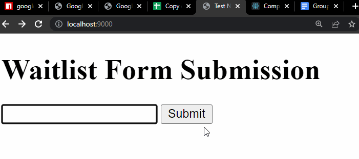

# Setting up the Sheets API
1. Create a [Sheets API account](https://www.youtube.com/watch?v=UGN6EUi4Yio)
2. Take the account's credentials and store it into `/server/secret.json`
3. Take the Spreadsheet ID of the sheet to edit and use it in the `GoogleSpreadsheet()` constructor in `spreadsheet.js`.

The linked workbook needs the following:
- a spreadsheet entitled "Waitlist" for storing client emails
- the "Waitlist" sheet needs to have a header called "Email"

# API Endpoints
## Waitlist Emails
The API can store emails from clients signing up for the waitlist. 

Send a `POST` request to `/api/waitlist` with the payload `{"email" : client_email_here}`
